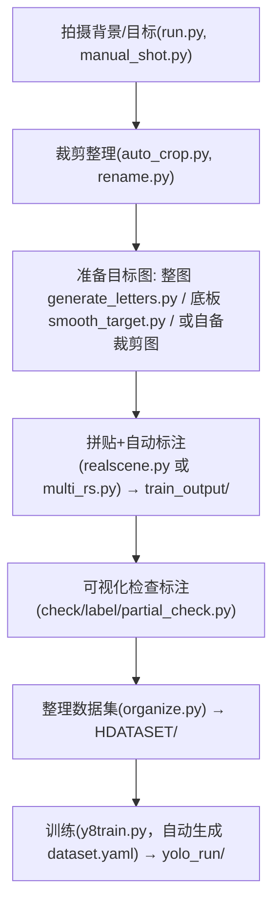

## 基于靶标组件拼贴的 YOLO 真实场景数据增强工具（通用版）

一个「把目标当组件、在真实背景上拼贴并自动生成 YOLO 标注」的数据增强流水线。
**换检测任务时，原则上只改根目录的 `config.yaml`，无需改任何脚本源码。**

### 1. 核心思想

- 把「目标图」（整张图就是目标，或"底板 + 内部识别区"）在随机裁剪、增强过的背景图上拼贴；
- 拼贴的同时按目标位置自动写出 YOLO 标注；
- 支持大量几何/颜色/噪声增强，快速造出规模化训练集。

### 2. 唯一配置源：`config.yaml`

所有类别、路径、数量、增强开关、训练超参都集中在 `config.yaml`。脚本通过
`from config import load_config` 读取（`config.py` 负责定位、解析、把相对路径解析为绝对路径）。

关键字段：

- `classes`：类别列表，**下标即 class_id**；目标图须按 `<目标目录>/<类名>/*.png` 组织。
- `paths.*`：背景、合成输出、数据集、训练结果等目录。
- `synth.target_types`：每类目标的来源目录 `dir`、`roi`、缩放范围 `scale`、旋转 `rotate`、
  羽化 `feather`、透明裁剪 `crop_transparent`。
  - `roi: null` → **整张目标图就是检测框**（最常用）。
  - `roi: [rx, ry, rw, rh]` → 目标是"底板"，**只框内部 ROI**（相对目标框的比例）。
- `synth.aug`：**增强菜单**（分 base/target/final 三层，每层 `{num, extra_prob, menu}`；
  每张图从菜单抽 num 种增强，每种按自身 prob 触发；全部可配置，换任务只改这里）。
- `synth.profile`：可选，指向 `tools/calibrate_augment_profile.py` 生成的校准 YAML，
  加载时与 `synth.aug` 深合并（数据驱动标定增强参数）。
- `synth.num_workers`：`1` 用单进程 `realscene.py`；`>1` 用多进程 `multi_rs.py`。
- `train.*`：训练超参；`yolo/dataset.yaml` 由 `y8train.py` 依据本文件自动生成。

### 3. 代码结构

- `realscene/realscene.py`（单进程）/ `realscene/multi_rs.py`（多进程）：拼贴 + 自动标注核心。
- `generate_letters.py`：**「整图即目标」范例生成器**（为每个类别画类名文字图，demo 用）。
- `target/smooth_target.py`：**「底板 + ROI」范例生成器**（把识别区贴到底板中心，demo 用）。
- `tools/`：采集（`manual_shot.py`）、裁剪（`auto_crop.py`）、重命名（`rename.py`）、
  数据集整理（`organize.py`）、标签转换（`json2yolo.py`）、增强标定（`calibrate_augment_profile.py`）、
  计数（`count.py`）。
- `check/`：可视化检查（`label/` 看标注框，`yolo/quick_test.py` 批量推理验证）。
- `yolo/`：训练（`y8train.py`）、混合微调（`finetune.py`）。
- `run.py`：对着场景自动连拍背景图。
- `target/target_new.py`、`target/fast_target_new.py`、`target/make.py`：**遗留**的 CIFAR 期实现，未迁移到配置，仅作参考。

### 4. 工作流



### 5. 快速开始（当前 config.yaml 即一个任务实例，改它就是换任务）

```bash
conda env create -f yolo_env.yml && conda activate <你的环境>

python run.py                     # 1. 拍背景图（按 q 退出）→ save_frame/，整理进 paths.backgrounds
python generate_letters.py        # 2. 生成示例目标图（仅演示，实际任务请自备目标图）
python realscene/realscene.py     # 3. 拼贴+标注 → paths.synth_output（先把 config 的 num_rounds 调小验证）
python check/label/partial_check.py  # 4. 抽查标注框是否正确
python tools/organize.py          # 5. 切分数据集 → paths.dataset
python yolo/y8train.py            # 6. 训练 → paths.yolo_runs
```

### 6. 换成你自己的任务

1. 改 `config.yaml` 的 `classes`。
2. 准备目标图放进 `target_types.<类型>.dir/<类名>/`（整图即目标就设 `roi: null`）。
3. 把背景照片放进 `paths.backgrounds`。
4. 跑第 3~6 步即可。

### 7. 注意点

- **先验证再放量**：先把 `synth.num_rounds` 调到几十，跑完用 `partial_check.py` 确认标注框正确，再加量。
- 开启 `synth.apply_geometric_aug` 等几何增强可能让识别框与目标出现细微偏移。
- 背景图的多样性直接决定模型泛化能力——实际会在什么背景上出现，就拍什么背景。
