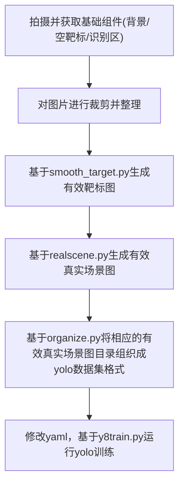
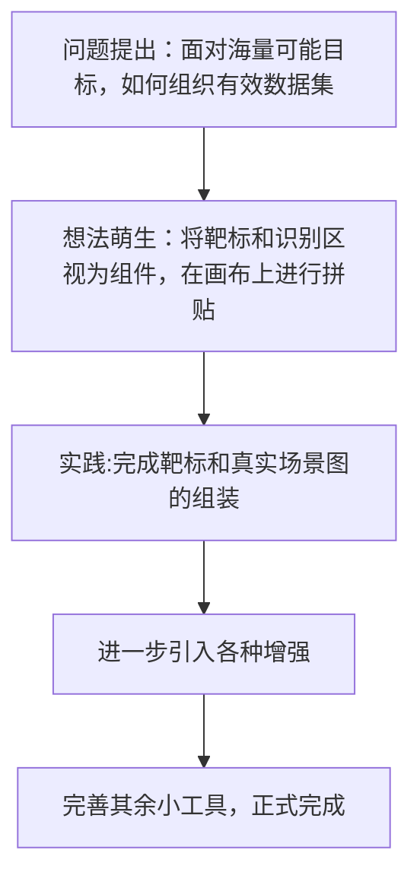

## 一种基于靶标组件对于YOLO进行自动化真实情景增强的高效方式

### 1. 代码结构

./target 下的smooth_target.py 基于识别区域图和空靶标图生成有效靶标图。

./realscene 下的realscene.py 基于有效靶标图和背景图生成有效真实场景图。

./tools 下为工具，包含裁剪、整理数据集结构等。

./check 下为用于可视化检查的代码。

### 2. 工作流

### 3. 注意点

拍摄时使用tools目录下manual_shot.py或run.py进行手动/自动的捕捉。

可以使用auto_crop.py对系列图片进行同一裁剪。

realscene.py中有若干可调整超参数，包括轮数(EPOCHS)，每轮最大生成数(ROUND)等等。开启几何增强可能导致yolo识别框出现略微偏移。

### 4. 技术路线

